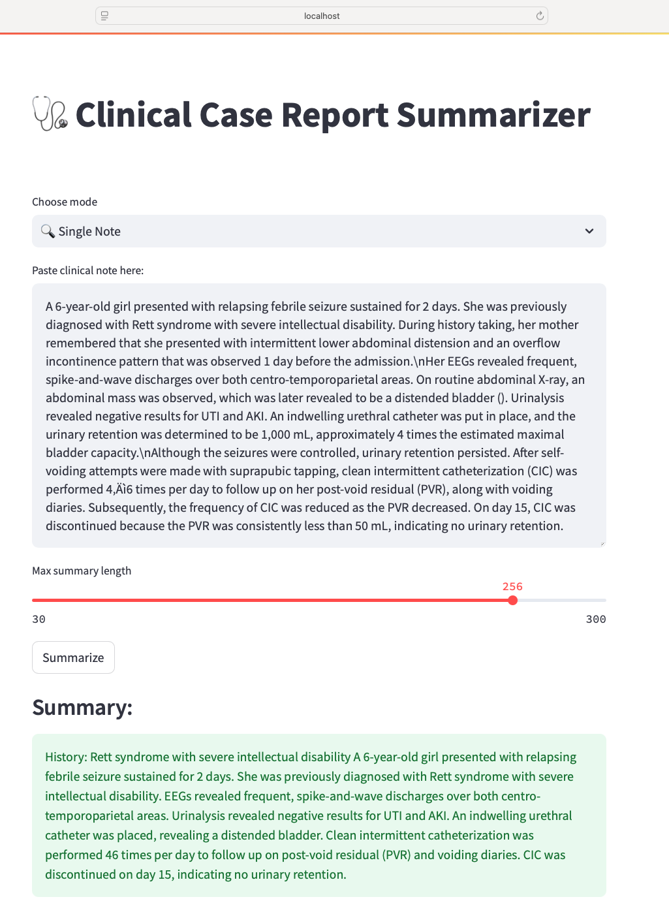

# 🩺 **Clinical Case Report Summarization**

This project implements an end-to-end NLP pipeline to summarize clinical case reports from PubMed using fine-tuned T5-based large language models (LLMs). It includes training, evaluation, and deployment components with a lightweight Streamlit app for real-time summarization. The project mimics real-world ML workflows and MLOps practices.

## **Key Features**

- **Fine-tuning of a T5 encoder-decoder LLM** on PubMed clinical case reports  
- **Structured prompt engineering** for clinically relevant summarization  
- **ROUGE and BERTScore evaluation** for lexical and semantic quality  
- **Streamlit-based UI** for interactive exploration and real-time summary generation  
- **Dockerized training environment** with scalable deployment on **AWS EC2 (GPU/CPU)**  
- **Model versioning and deployment** managed via **AWS ECR**


## **Launch Demo:**
Launch the app locally with:
```code
streamlit run app/streamlit_app.py
```

## **Demo Output:**

<p align="center">
  
</p>


## **Project Structure**

```text
clinical-summarization/
├── src/                    # Training and inference scripts
├── app/                    # Streamlit UI and config
├── data/                   # Processed case reports and chunked datasets
├── models/                 # Saved models and checkpoints
├── infra/                  # Container setup - Dockerfile
├── requirements.txt        # Python dependencies
└── parameters.json
└── README.md
```


## **Evaluation**
The model is evaluated using:

ROUGE-1, ROUGE-2, ROUGE-L

BERTScore (F1) using contextual embeddings


## **Tech Stack**

Python, PyTorch, Hugging Face Transformers, T5, Docker, AWS EC2, AWS ECR, Streamlit, ROUGE, BERTScore


## **Coming Soon**

ONNX export + Triton inference server integration

Hugging Face Spaces deployment (optional)
